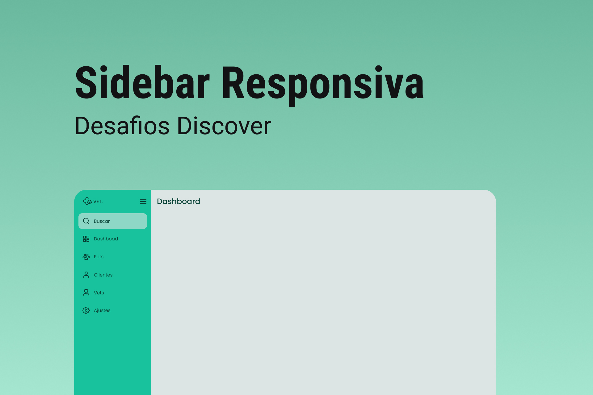

<h1 align="center"> Animated Sidebar </h1>

Projeto de barra lateral para uma empresa imaginária. O projeto tem a barra responsiva e totalmente animada (pelo JS)  

  <a href="#-tecnologias">Tecnologias</a>&nbsp;&nbsp;&nbsp;|&nbsp;&nbsp;&nbsp;
  <a href="#-projeto">Projeto</a>&nbsp;&nbsp;&nbsp;|&nbsp;&nbsp;&nbsp;
  <a href="#-layout">Layout</a>&nbsp;&nbsp;&nbsp;|&nbsp;&nbsp;&nbsp;
  <a href="#memo-licença">Licença</a>

  

 

  

## 🚀 Tecnologias

Esse projeto foi desenvolvido com as seguintes tecnologias:

- HTML e CSS
- JavaScript
- Git e Github
- Figma

## 💻 Projeto

Uma página inicial. Totalmente responsiva, animada (pelo JS) 💡.

- [Visite o projeto online e teste agora mesmo!](https://pedrohenrikle.github.io/sidebar/)

## 🔖 Layout

Você pode visualizar o layout do projeto através [DESSE LINK](<https://www.figma.com/file/yh0e9ysHYUh743huO57ktb/DD-%2F-Sidebar-Responsiva-(Copy)?node-id=0%3A1&t=GcbQXZtNrHMN3R5g-0>). É necessário ter conta no [Figma](https://figma.com) para acessá-lo.

## :memo: Licença

Esse projeto está sob a licença MIT.

---

## ✍ Author
 

    Made with 💜 by Pedro Henrique Klein

    
    

